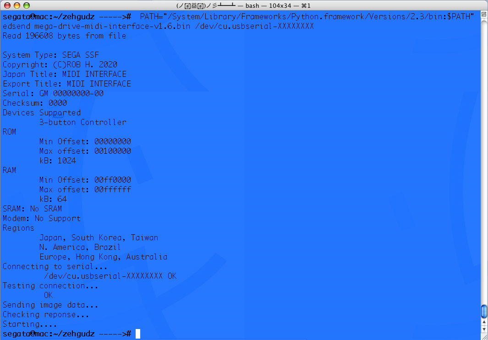

# SG-Tools

Collection of developer utilities targeted for platforms made by Sega (originally known as _Service Games_).

## Overview

This set of modules enables developers for Sega 8-bit and 16-bit platforms to read header
information and to send image files to a Mega Everdrive X7.

### Features

* Send a file to a MegaEverdrive X7 via USB.
  * Genesis/Mega Drive
  * Sega CD (BIOS)
  * Mark III/Master System  
    
* Display the header information of a Sega image.
  * Genesis/Mega Drive
  * 32X
  * Mark III/Master System
  * Game Gear  
    

Tested on Python versions 2.3.5, 2.7. 3.7, and 3.9 on gentoo Linux and Mac OS X 10.4.

## Download

### Binaries

 Prebuilt source packages and wheel can be found in the `/dist/` directory.

### Cloned from source

`git clone https://github.com/vbvr/sg_tools`

## Install

### Prerequisites

 Python 2.3.5 or newer  
 [pySerial 2.7 or newer](https://github.com/pyserial/pyserial) for communicating with the Mega
  Everdrive. This package is hosted on pyPI.  
 _On some systems, the [FTDI driver](https://www.ftdichip.com/old2020/Drivers/VCP.htm) may need to
 be installed, as well._

#### _With `pip` (recommended)_

 Create your virtual environment:

  ```bash
  mkdir sg_tools
  python -m virtualenv sg_tools
  . sg_tools/bin/activate
  ```
  
 Install the package or wheel:

 `pip install /path/to/sg_tools-X.XX.tar.gz`  
 `pip install /path/to/sg_tools-X.XX-py2.py3-none-any.whl`

 _Alternatively, install in your user environment with `--user`_

#### Without `pip` (Python 2.5 or below)

 Installing PySerial:

 ```bash
 wget --no-check-certificate --content-disposition https://files.pythonhosted.org/packages/df/c9/d9da7fafaf2a2b323d20eee050503ab08237c16b0119c7bbf1597d53f793/ pyserial-2.7.tar.gz
 tar -xzf pyserial-2.7.tar.gz && cd pyserial-2.7 && python2 setup.py install
 ```

 __Note:__ _Use of `sudo` might be required on your system_  
 __Note:__ _pySerial needs patching for Python 2.5 and below_

 ```bash
 sudo sed -Ei 's/0o/0/' $(python -c "import serial as _; print(_.__path__)[0]")/serialposix.py
 ```

 Installing SG-Tools:

 ```bash
 tar -xzf sg_tools-X.XX-nopip.tar.gz && cd sg_tools-X.XX-nopip && python2 setup.py install
 ```

 __Note:__ _Use of `sudo` might be required on your system_

## Examples

### From a UNIX shell

`edsend md-proto.bin`  
`sg-header smspd.sms`

### From the Python interpreter

```python
from sg_tools.edsend import Loader
everdrive = Loader("/path/to/file")
everdrive.init()
everdrive.start()
```  

If all goes well, your Genesis/Mega Drive will have started up the contents of your file.

```python
from sg_tools import header

hdr = header.load("/path/to/file")
hdr.metadata("domestic")
```

The output would look something like this is:
   
 _(Display of Japanese characters supported with Python 2.5 and a compatible pseudo terminal)_

## Changelog

05/19/2022 - Initial release

## Contact

Check out my [profile](https://github.com/vbvr)!

## License

vbvr, Copyright 2022
See [LICENSE](LICENSE) for details.

## Resources

[beardedfoo](https://github.com/beardedfoo/devkit-mega-everdrive-x7)
[Krikzz](https://krikzz.com)  
[Plutiedev](https://plutiedev.com)
[SMS Power!](https://smspower.org)  
