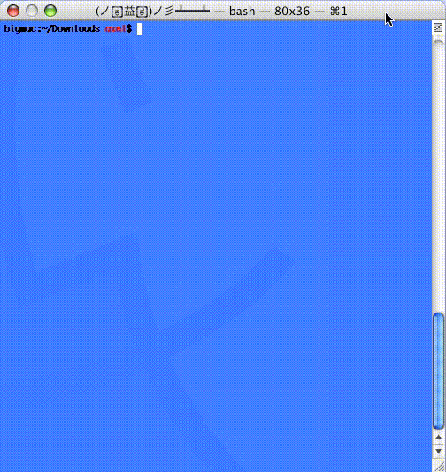
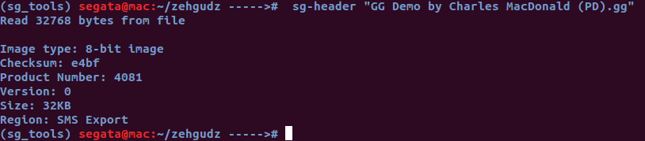

# SG-Tools

Collection of developer utilities targeted for platforms made by Sega (originally known as _Service Games_).

## Overview

This set of modules enables developers for Sega 8-bit and 16-bit platforms to read header
information and to send image files to a Mega Everdrive X7.

### Features

* Send a file to a MegaEverdrive X7 via USB.
  * Genesis/Mega Drive
  * Sega CD (BIOS)
  * Mark III/Master System  
    
* Display the header information of a Sega image.
  * Genesis/Mega Drive
  * 32X
  * Mark III/Master System
  * Game Gear  
    

Tested on Python versions 2.3.5, 2.7. 3.7, and 3.9 on gentoo Linux and Mac OS X 10.4.

## Download

### Binaries

 Prebuilt source packages and wheel can be found in the `/dist/` directory.

### Cloned from source

`git clone https://github.com/vbvr/sg_tools`

## Install

 [Using `pip`](docs/INSTALL.md) (recommended method for modern versions of Python)  
 [Using `setup.py`](docs/INSTALL2.md) (recommended for older setups without pip)

## Examples

### From a UNIX shell

`edsend md-proto.bin`  
`sg-header smspd.sms`

### From the Python interpreter

```python
from sg_tools.edsend import Loader
everdrive = Loader("/path/to/file")
everdrive.init()
everdrive.start()
```  

If all goes well, your Genesis/Mega Drive will have started up the contents of your file.

```python
from sg_tools import header

hdr = header.load("/path/to/file")
hdr.metadata("domestic")
```

The output would look something like this is:
   
 _(Display of Japanese characters supported with Python 2.5 and a compatible pseudo terminal)_

## Changelog

05/19/2022 - Initial release

## Contact

Check out my [profile](https://github.com/vbvr)!

## License

vbvr, Copyright 2022
See [LICENSE](LICENSE) for details.

## Resources

[beardedfoo](https://github.com/beardedfoo/devkit-mega-everdrive-x7)  
[Krikzz](https://krikzz.com)  
[Plutiedev](https://plutiedev.com)  
[SMS Power!](https://smspower.org)  
